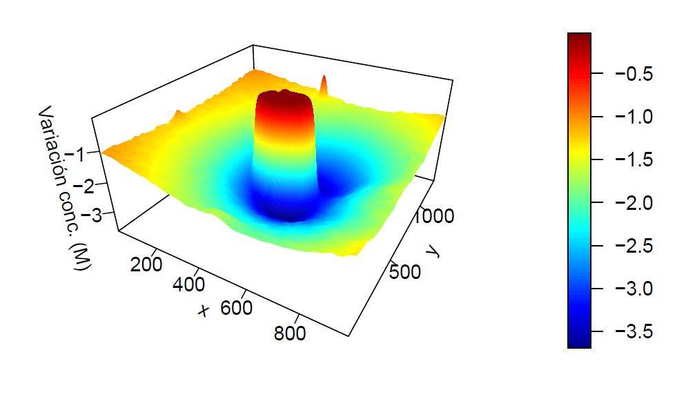
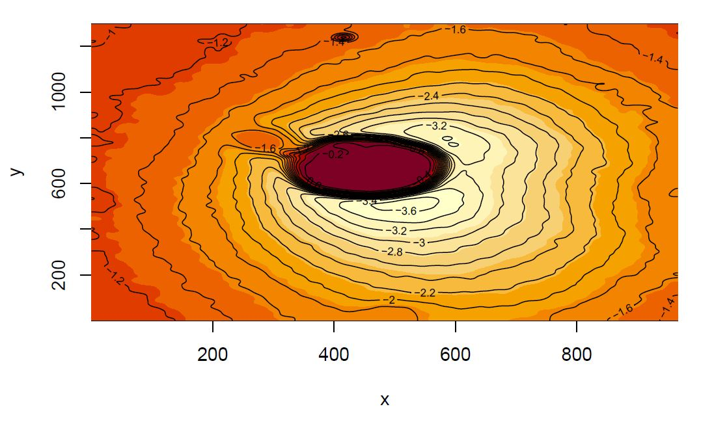

```{r setup, include=FALSE}
knitr::opts_chunk$set(echo = TRUE, collapse=TRUE)
```

<div class=text-justify>

## 1 INTRODUCCIÓN

El objetivo de este trabajo es dar una alternativa a los estudiantes del Grado de Física de la Universidad de Granada, y por extensión a los de cualquier carrera con prácticas de laboratorio de cualquier grado, a la hora de realizar sus informes de práticas. \

La idea surge cuando, como estudiantes tanto de Física como de Matemáticas de la UGR, nos damos cuenta de que cada vez que realizamos una práctica, vemos limitados nuestros informes por el conocimiento de las herramientas que usamos para los mismos. Concretamente, al inicio del grado se nos da una muy breve introducción al programa de código abierto *Gnuplot* para realizar con él la mayoría de las tareas que se plantean en un informe de prácticas.\

Sin embargo, tras el descubrimiento del lenguaje de programación R y su entorno de desarrollo RStudio, nos dimos cuenta de que hay tareas que son mucho más sencillas de implementar haciendo uso de esta herramienta. Por tanto, nuestra meta con este trabajo es dotar al lector de las herramientas más sencillas de R que permiten realizar las tareas rutinarias de un informe de prácticas. Para ello, lo que haremos será usar ficheros de datos tomados por nosotros mismos y tratar de repetir dichas tareas con R. \

Los ficheros de datos, así como el script .Rmd con el código utilizado para generar este documento (que bien puede ser modificado para crear un informe de prácticas) pueden ser encontrados en el siguiente enlace:  \
\
https://drive.google.com/drive/folders/1KYtm6pNyvjz0Dimnuzd0MOgnx6gsOpQb?usp=sharing \
https://github.com/acanort/TRABAJO-ESTADISTICA-COMPUTACIONAL \
\


## 2 REPRESENTACIONES CON BARRAS DE ERROR Y AJUSTES

#### 2.1 Ajuste lineal \

Este tipo de ajuste es el más básico de todos los que vamos a aprender. Buscaremos que nuestros datos ajusten mediante una fórmula del tipo $y=mx+n$  .

Este tipo de ajuste es muy útil, por ejemplo, para la práctica del “Péndulo de Foucault” que consiste en ????

Los valores obtenidos son recogidos en un archivo .txt con el nombre “lineal”, con las primeras dos columnas con los datos obtenidos de tiempo y ángulo, y los dos siguientes sus respectivos errores.

Para realizar los ajustes y representación de barras de error utilizaremos la librería ggplot2.

En primer lugar, cargamos la librería y los datos en un data frame llamado “data”, y añadiremos el comando attach(data) para poder referirnos a cada una de sus columnas.

```{r}
library(ggplot2)
data <- read.table(file="2.1. Pendulo Foucault (lineal).txt", header=TRUE)

attach(data)
```

A continuación, realizamos la representación de los datos con sus respectivas barras de error.

```{r}
p <- ggplot(data, aes(t, theta))+ geom_point() + geom_line()  
p2<- p + geom_errorbar(aes(xmax = t + errort, xmin = t - errort), colour="green") + geom_errorbar(aes(ymax = theta + errortheta, ymin = theta - errortheta), colour="blue"); p2
```

Finalmente, hacemos el ajuste lineal propiamente dicho, utilizando el comando “lm” aprendido en clase, gracias al cual, mediante el comando “summary” podemos obtener los valores buscados.

```{r}
p2 + geom_smooth(method = "lm", se = FALSE, col="red")

#si queremos ver representado además el intervalo de confianza al x% debemos eliminar se=FALSE y añadir en su lugar level=x el nivel que queremos

mod<- lm(theta~t); mod

mod$parameters
```

Obtenemos en este caso un valor del ajuste de $m=-4.311\cdot10^{-5} \pm 3.182\cdot10^{-7}$ y $n=-9.223\cdot10^{-1}\pm6.833\cdot10^{-4}$que, junto al $p$-valor asociado, aproximadamente 0, y el valor “multiple R-squared”, aproximadamente 1, las variables ajustan perfectamente mediante una regresión lineal.

#### 2.2 Ajuste exponencial \

Vamos a realizar un ajuste exponencial. Para ello, vamos a coger los datos del fichero `2.2. Calibrado termistor (exponencial).txt`. En esta práctica se utiliza un termistor, esto es un sensor de temperatura por resistencia. La fórmula del ajuste a realizar corresponde a $R=a\cdot e^{b/T}$, siendo $R$ la resistencia y $T$ la temperatura. 

Conocido ya el método lineal para realizar ajustes, podemos hacer uso de transformaciones para reducir el problema al caso lineal. En este ejemplo, se procedería de esta manera:

\[
R=a\cdot e^{b/T}\Rightarrow\ln(R)=\ln(a\cdot e^{b/T})\Rightarrow\ln(R)=\ln(a)+\frac{b}{T}
\]

En este caso, el ajuste lineal a realizar sería $\ln(R)$ en función de $T^{-1}$. Comenzamos importando los datos y los paquetes que usaremos. 

```{r}
data2<- read.table(file="2.2. Calibrado termistor (exponencial).txt", header=TRUE)
attach(data2)
```

```{r}
library(mosaic)
# library(dplyr)
```

Procedemos a hacer los cambios $R\rightarrow\ln(R) = \text{aux1}$ y $T\rightarrow T^{-1}=\text{aux2}$. Con esto, simplemente resta hacer el ajuste lineal como en la sección 2.1.

```{r}
aux1 <- log(Resist)
aux2 <- Temp^{-1}

fit <- lm(aux1~aux2)

plot(aux2,aux1, xlab='1/T', ylab='ln(R)') + abline(fit)
```

Una vez ajustado de forma lineal, deshacemos los cambios para volver al ajuste exponencial. En este caso el parámetro de la pendiente del ajuste lineal permanece igual, pero la ordenada en el origen hay cambiarla, pues esta es la exponencial de la obtenida. Representamos entonces los datos originales justo a su ajuste exponencial.

```{r}
a <- as.double(exp(fit$coefficients[1]));a
typeof(a)
b <- as.double(fit$coefficients[2]);b
typeof(b)
plot(Resist,Temp) 
lines(a*exp(b/Temp),Temp)
```


#### 2.3 Ajuste cosenoidal \

```{r}
data3<- read.table(file="2.3. Ondas termicas (cosenoidal).txt", header=TRUE)
#attach(data3)
```

```{r}
dataaux <- data3[81:101,];head(dataaux)
attach(dataaux)
```


```{r}
fit <- fitModel(Temp~a*cos(b*tiempo+c)+d,data=dataaux)

plot(tiempo, Temp, col='red', lwd=2, xlab='Radio r (m)', ylab='Intensidad I (A)') +
arrows(tiempo,Temp+errTemp,tiempo,Temp-errTemp,code=3,length = 0.05) +
arrows(tiempo+errtiempo,Temp,tiempo-errtiempo,Temp,code=3,length = 0.05)
curve(fit,col='red',lwd=2, add=T)

legend('topright','150 V',col='red',lwd=5)

```

#### 2.4 Ajuste por función racional \

Para terminar con esta pequeña lista de ejemplos de ajustes paramétricos, vamos a tratar de hacer un ajuste racional. Para ello, hemos seleccionado un experimento llamado "Relación carga-masa del electrón". En él, tenemos un campo magnético generado por unas bobinas. Este desvía un haz de electrones, cuya trayectoria final forma circunferencias. Si estudiamos la intensidad de corriente necesaria para que las circunferencias tengan cierto radio, podemos obtener la relación entre la carga y la masa de los electrones. En particular, la relación que liga estas dos variables es
\[
I(r)=\sqrt{\frac{m}{e}\left(\frac{5}{4}\right)^3\frac{2VR^2}{(N\mu_0)^2}}\cdot\frac{1}{r}\equiv\frac{a}{r}.
\]
Para simplificar, a todos los parámetros que aparecen dentro de la raíz los hemos denotado por $a$. El experimento se repite 4 veces, cada uno para un valor de voltaje $V$ distinto. Los datos se encuentran en el fichero `1. Relación carga-masa electrón (inversa)`.

Como siempre, hacemos primero una lectura de los datos. 

```{r}
datos <- read.table('2.4. Relacion carga-masa electron inversa.txt',header = T)
attach(datos)
```

Procedamos de manera directa a hacer el ajuste de los datos. Para ello vamos a usar una función de la forma
\[
I(r)=\frac{a}{r}
\]

```{r, include=FALSE}
library(mosaic)
library(dplyr)
library(shape)
```

```{r}
f150 <- fitModel(I150V_A~a/r_m,data=datos)

plot(r_m, I150V_A, col='red', lwd=2, xlab='Radio r (m)', ylab='Intensidad I (A)', las=1)
arrows(r_m,I150V_A+err_I,r_m,I150V_A-err_I,code=3,length = 0.05)
arrows(r_m+err_r,I150V_A,r_m-err_r,I150V_A,code=3,length = 0.05)
curve(f150,add=T,col='red',lwd=2)
legend('topright','150 V',col='red',lwd=5)

```

Una vez que hemos hecho lo anterior, no tenemos más que repetir tres veces más para obtener los 4 ajustes que queríamos.

```{r}
#Realizamos los ajustes que nos faltan
f200 <- fitModel(I200V_A~a/r_m,data=datos)
f250 <- fitModel(I250V_A~a/r_m,data=datos)
f300 <- fitModel(I300V_A~a/r_m,data=datos)

#Representamos los datos
plot(r_m,I150V_A,col='red', lwd=2, xlab='Radio r (m)', ylab='Intensidad I (A)',
   las=1, ylim=c(1,5))
curve(f150,add=T,col='red',lwd=2)
arrows(r_m,I150V_A+err_I,r_m,I150V_A-err_I,code=3,length = 0.05)
arrows(r_m+err_r,I150V_A,r_m-err_r,I150V_A,code=3,length = 0.05)

lines(r_m,I200V_A,col='orange',lwd=2,type='p')
curve(f200,add=T,col='orange',lwd=2)
arrows(r_m,I200V_A+err_I,r_m,I200V_A-err_I,code=3,length = 0.05)
arrows(r_m+err_r,I200V_A,r_m-err_r,I200V_A,code=3,length = 0.05)

lines(r_m,I250V_A,col='green',lwd=2,type='p')
curve(f250,add=T,col='green',lwd=2)
arrows(r_m,I250V_A+err_I,r_m,I250V_A-err_I,code=3,length = 0.05)
arrows(r_m+err_r,I250V_A,r_m-err_r,I250V_A,code=3,length = 0.05)

lines(r_m,I300V_A,col='blue',lwd=2,type='p')
curve(f300,add=T,col='blue',lwd=2)
arrows(r_m,I300V_A+err_I,r_m,I300V_A-err_I,code=3,length = 0.05)
arrows(r_m+err_r,I300V_A,r_m-err_r,I300V_A,code=3,length = 0.05)

legend('topright',c('150 V','200 V','250 V','300 V'),col=c('red','orange','green'
  ,'blue'),lwd=5)

#Leemos los datos relativos a los ajustes
summary(f150)$parameters

summary(f200)$parameters

summary(f250)$parameters

summary(f300)$parameters
```

Por tanto, los resultados así obtenidos son los que se presentan en la tabla siguiente:


| Voltaje V (V) | $a$    | $\Delta a$ |
|---------------|--------|------------|
| $150\,V$      | 0.0614 | 0.0011     |
| $200\,V$      | 0.0697 | 0.0006     |
| $250\,V$      | 0.0786 | 0.0006     |
| $300\,V$      | 0.0864 | 0.0008     |

Tenemos además que los $p$-valores asociados son muy pequeños, lo cual es un buen indicador de la bondad de los ajustes realizados.

## 3 INTEGRACIÓN NUMÉRICA

A continuación, nuestro objetivo consiste en la implementación de la integración numérica en un caso práctico. En particular, vamos a ver un  ejemplo aplicado al experimento "Ciclo de histéresis", el cual trata de un estudio del fenómeno que sufren determinados materiales por el cual son capaces de conservar en cierta medida algunas de sus propiedades en ausencia de los estímulos que las han generado, o lo que es lo mismo, el estado actual de dichos materiales dependen de sus estados anteriores. En este caso nos hemos focalizado en la histéresis magnética del hierro macizo, de modo que estudiamos la inducción remanente de un campo magnético $\vec{B}$ tras aplicar y variar una excitación magnética $\vec{H}$ en el mismo hasta realizar un ciclo completo. Para ilustar la situación, leemos los datos experimentales recogidos y los representamos gráficamente.

```{r}
# Leemos los datos
datos <- read.table('3. Histeresis.txt', header = T)

# Para hacer referencia directamente a los nombres de las variables
attach(datos)
head(datos)

# Representamos gráficamente los datos
plot(H,B,col='red',lwd=2,xlab='H (A/m)', ylab='B (T)',las=1)
arrows(H,B+errB,H,B-errB,code=3,length = 0.05)
arrows(H+errH,B,H-errH,B,code=3,length = 0.05)
```

Ahora bien, en muchas ocasiones es conveniente cuantizar las pérdidas por unidad de volumen por histéresis en el material, como por ejemplo para discernir en qué situaciónes es adecuada su utilización.  Para ello, necesitamos calcular el área encerrada bajo las dos curvas presentes en la gráfica y aquí es donde entra en juego la integración numérica, la cual llevamos acabo utilizando la función `int.simpson2` del paquete `fda.usc`, el cual nos permite ingresar los datos y ejecutar la tarea en cuestión utilizando diferentes métodos numéricos. Sus argumentos son los siguientes:

1. `x`, `y`: vectores correspondientes a los datos de los ejes x e y, respectivamente.
2. `equi`: tiene por defecto el valor `TRUE` e indica si los datos se suponen equiespaciados.
3. `method`: su valor por defecto es `NULL` y permite seleccionar el método de integración numérica. Los posibles a elegir son: 
    + `'TRAPZ'`: regla del Trapecio.
    + `'CSR'`: regla de Simpson compuesta.
    + `'ESR'`: regla de Simpson generalizada.
    
  
Si `method=NULL` el valor que se usa es el dado por `par.fda.usc$int.method`.


Una vez descrita nuestra herramienta, procedemos al cálculo de las pérdidas por histéresis. En primer lugar vamos a separar en dos variables diferentes los datos de las dos curvas que se muestran en el ciclo de histérisis, designando como `arriba` a la que muestra los mayores valores de $\vec{B}$ en el intervalo considerado para $\vec{H}$ y, por el contrario, llamaremos `abajo` a la que tiene los menores valores de $\vec{B}$. Por tanto, la tarea se resume en determinar el área que encierra cada curva y posteriormente restarlas. Como usaremos varios métodos de integración con el obtetivo de comparar los resultados obtenidos para cada uno, definimos la función `perdidas` cuyo único argumento permita seleccionar cuál de ellos utilizar para el cálculo.

```{r}
# Separamos las dos curvas de la gráfica anterior
arriba <- datos[c(1:which.min(B), length(B)),]
abajo <- datos[which.min(B):length(B),]
```


```{r echo=TRUE, results='hide', message = FALSE, warning=FALSE}
# Cargamos el paquete
library(fda.usc)
```

```{r}

# Definimos la función de pérdidas por histéresis según el método de integración
perdidas <- function(metodo = NULL){
  int.arriba <- int.simpson2(arriba$H, arriba$B, method = metodo)
  int.abajo <- int.simpson2(abajo$H, abajo$B, method = metodo)
  return(int.arriba-int.abajo)
}
```

```{r}
# Regla del Trapecio
perdidas('TRAPZ')

# Regla de Simpson compuesta
perdidas('CSR')

# Regla de Simpson generalizada
perdidas('ESR')

# Métdodo por defecto
perdidas()

```

Como podemos observar, en este caso `method=NULL` nos proporciona el mismo resultado que el de la regla del Trapecio. 

## 4. DERIVACIÓN NUMÉRICA

Partimos del experimento "Fenómenos termoeléctricos: Estudio del termopar Fe-Cu", donde queremos calcular
el coeficiente Seebeck o poder termoeléctrico $P$ de un termopar, el cual se define como la variación de f.e.m. por unidad de temperatura, esto es, 

$$P=\frac{d\varepsilon}{dT}.$$
Determinar esta magnitud de forma directa resulta una tarea algo complicada, por no decir imposible. Sin embargo, es posible aproximar sus valores tomando medidas de la f.e.m  en función de la temperatura y aplicar a los datos recogidos algún método de derivación numérica. Dada la simplicidad y la eficacia que nos proporciona, optamos por hallar la diferencia relativa de valores de f.e.m y dividirla por la diferencia de temperaturas correspondiente, es decir, utilizamos 

$$P \approx \frac{\Delta \varepsilon}{\Delta T}.$$

Para ello, recurrimos a la función `diff`, la cual nos permite reducir esta tarea a una solo sentencia.


Ya explicado el procedimiento recogemos los datos de f.e.m tomados para cado valor de temperatura y los representamos gráficamente.
```{r}
# Leemos los datos
datos <- read.table('4. Termopar.txt', header = T)

# Para hacer referencia directamente a los nombres de las variables
attach(datos)

# Representamos gráficamente los datos
plot(Temp,fem,col='red',lwd=2,xlab='T (K)', ylab='F.e.m. (mV)',las=1)
```

A continuación, calculamos el poder termoeléctrico $P$ en función de la temperatura utilizando derivación numérica. Luego, exponemos los resultados en un gráfico. 

```{r}
# Calculamos poder termoeléctrico usando derivación numérica
P <- diff(c(0,fem))/diff(c(0,Temp)) 

# Representamos el poder termoeléctrico frente a la temperatura
plot(Temp,P,col='red',lwd=2,xlab='T (K)', ylab='P (mV/k)',las=1)
```


## 5. GRÁFICAS 3D

Hay ocasiones en que el uso de gráficos en dos dimensiones puede limitar nuestra capacidad de entendimiento de alguna magnitud. Vamos a ejemplificarlo con el fenómeno de la polarización de concentración. \

Cuando introducimos partículas de carbón activado en una disolución salina y aplicamos un campo eléctrico externo, se producen ciertos fenómenos de superficie que dan lugar a una redistribución de iones. Utilizando iones fluorescentes y un microscopio de fluorescencia este fenómeno es perfectamente visible. Si tomamos una foto del fenómeno, y haciendo uso de disoluciones patrón de concentraciones conocidas, podemos obtener una matriz de concentraciones (cada entrada de la matriz se corresponde con la posición de un píxel de la imagen). Este es el procedimiento utilizado para obtener el fichero de datos `4. Polarización de concentración.txt` utilizado.\

Queremos hacer una representación tridimensional de los datos de dicho fichero, para lo cual es necesario saber que están organizados en 1296 columnas y 966 filas (píxeles de la imagen inicial).

Comenzamos haciendo la lectura de los datos (siempre desde el directorio de trabajo adecuado). En este caso, para hacer la lectura de la matriz hemos tenido que especificar que haga la lectura por filas y el número de columnas que existen.

```{r}
datos <- matrix(scan(file='5. Polarizacion de concentracion.txt'),ncol=1296,byrow=TRUE)
```

Una vez hecho esto,vamos a hacer uso del paquete `plot3D` para obtener la gráfica deseada. Como siempre, ejecutamos la orden `install.packages("plot3D")` para instalarlo, y a continuación vemos cómo cargar el paquete y cómo generar la gráfica.

```{r}
library(plot3D)

x <- c(1:966)
y <- c(1:1296)

# persp3D(x, y, datos, xlim=c(1,966), ylim=c(1,1296), expand=0.5, scale=TRUE, ticktype = "detailed",
#        xlab='x', ylab='y', zlab='Variación conc. (M)', border=NA, theta=30, phi=30)
```



Como vemos, esta representación nos da una idea muy buena de cómo se comportan los iones. Justo en el centro tenemos la partícula de carbón. En su interfase, se produce una bajada súbita de la concentración con respecto a la inicial (en rojo). \

Dejando a un lado la física, analicemos qué parámetros podemos usar con `persp3D`: \
1. `x`, `y`, `z`: es obligatorio introducir un vector x y un vector y para los ejes, y una matriz con los datos a representar. Las dimensiones de la matriz deben coincidir con la de x (filas) y las de y (columnas). \
2. `xlim`, `ylim`, `zlim`: como en todos los gráficos, podemos utilizar estos argumentos para fijar los intervalos representados en los ejes pasándoles vectores con dos elementos, el mínimo y el máximo. \
3. `xlab`, `ylab`, `zlab`: para fijar los nombres de los ejes. \
4. `main`: se usa para ponerle título al gráfico. \
5. `theta`, `phi`: estos dos parámetros son ya más específicos de los gráficos en tres dimensiones. Sirven para fijar la perspectiva desde donde vemos el gráfico, correspondiéndose ambos parámetros con nuestra posición en coordenadas esféricas con respecto al gráfico. Por defecto están ambas fijas en 40 grados. \
6. `border`: sirve para poner líneas de cierto color separando cada uno de los datos representados. En nuestro caso, con casi 1.300.000 datos hay que quitarla, porque si introducimos las líneas, nos tapan el gráfico. Se suele usar con menos datos. \
7. `col`: para cambiar el color. Por defecto usa los colores que se muestran (`col=jet.col()`), pero podemos hacer `col=ramp.col(c('yellow','green','pink'),n=50)`, lo cual nos daría un degradado de 50 colores, empezando en amarillo, pasando por verde y terminando en rosa. \
8. Existen muchos más argumentos, ya más específicos, que podemos ver si ejecutamos el comando `help(persp3D)`.\

Otra representación que también nos puede ayudar en estos casos son las curvas de nivel asociadas a nuestro gráfico 3D. Para construirlas, generamos primero el fondo con `image` y luego añadimos las curvas de nivel con `contour`.

```{r}
# image(x,y,datos)
# contour(x,y,datos,add = TRUE,nlevels = 15)
```



Los parámetros asociados a `persp3D` también pueden ser utilizados para las curvas de nivel. Cabe destacar que para `contour` tenemos además:\
1. `nlevels`: para seleccionar cuantos niveles distintos queremos. \
2. `lty`,`lwd`,`col`: para cambiar el tipo de línea, la anchura de línea y el color de línea. \


## 6. ANIMACIONES GIF

En esta sección aprenderemos a hacer, haciendo uso del lenguaje de programación R y de R-Studio, algunos de los tipos de animaciones que nos han sido útiles a lo largo de la carrera, y que pensamos que pueden ser muy vistosos de cara a la exposición de datos tomados en el laboratorio o simulados mediante ordenador. También es un recurso muy llamativo si pensamos en la exposición de algún trabajo de clase o incluso el Trabajo de Final de Grado.

Haremos uso de los paquetes `ggplot2`, `gganimate` y `gifski`, los cuales introduciremos más adelante.

#### 6.1 Representación de la evolución temporal de una cantidad

Esta primera animación consiste en representar la evolución de determinadas cantidades a lo largo del tiempo, aunque se puede extrapolar a la representación de una variable en función de otra.

Como ejemplo tomaremos la evolución del ángulo respecto a la vertical que describe un péndulo forzado y amortiguado al ser simulado mediante diferentes algoritmos: algoritmo de Verlet, algoritmo de Euler-Cromer y algoritmo de Runge-Kutta de orden 4.

El sistema en cuestión consiste en un péndulo sometido a una fuerza de rozamiento que hace que la amplitud de la oscilación no sea constante. En otras palabras, esta fuerza de rozamiento va frenando al péndulo a lo largo del tiempo. A lo descrito anteriormente se le añade un fuerza impulsora de tipo sinusoidal. La ecuación que describe el movimiento del péndulo es la siguiente:

$$
\frac{\mathrm{d^2}\theta}{\mathrm{d}t^2}=-\frac{g}{l}\sin(\theta)-q\frac{\mathrm{d}\theta}{\mathrm{d}t}+F_D\sin(\Omega_Dt),
$$

donde $\theta$ es el ángulo respecto de la vertical (restringido al intervalo $[0,2\pi]$), $g$ es la aceleración de la gravedad, $l$ es la longitud del péndulo, $q$ es la constante de amortiguamiento, y $F_D$ y $\Omega_D$ son la amplitud y la frecuencia de la fuerza impulsora respectivamente.

En los archivos `datospendulo_verlet.dat`, `datospendulo_euler.dat` y `datospendulo_RK.dat` podemos encontrar datos (ángulo, coordenadas $x$ e $y$ del extremo del péndulo y velocidad angular) en función del tiempo correspondientes a la evolución del sistema usando los tres algoritmos mencionados con condiciones iniciales $\theta_0=0.2$, y $\dot{\theta}_0=0$. Se ha escogido $q=1/2$, $l=g=9.81$, $F_D=1.2$ y $\Omega_D=2/3$. El paso temporal tomado para los algoritmos fue $h=0.04$ en todos.

En principio la evolución del péndulo debería de ser la misma, pues el sistema es determinista. Sin embargo, este sistema es caótico, por lo que en cuanto los errores numéricos asociados a los diferentes algoritmos se hagan patentes, las trayectorias se separarán entre sí a ritmo (teóricamente) exponencial.

Para realizar un *gif* que muestre la evolución del ángulo en función del tiempo con los tres algoritmos, comenzamos guardando en *dataframes* el contenido de los archivos *dat* ya mencionados. Además añadimos una columna que indique el algoritmo usado, para que en el archivo *gif* podamos distinguir con qué método se evolucionó el péndulo.

```{r}
verlet <- read.table(file="6.1. Verlet.txt",header=TRUE)
euler <- read.table(file="6.1. Euler.txt",header=TRUE)
RK <- read.table(file="6.1. RK.txt",header=TRUE)

verlet$Algoritmo <- 'Verlet'
euler$Algoritmo <- 'Euler-Cromer'
RK$Algoritmo <- 'Runge-Kutta'
```

Concatenamos las columnas que nos interesan en un nuevo *dataframe*, en este caso `Tiempo`, `Angulo` y `Algoritmo`. Esto es, el primer tercio de las filas corresponden a datos generados con el algoritmo de Verlet, el segundo tercio a datos creados a partir del algoritmo de Euler-Cromer, y el último tercio a partir de Runge-Kutta de orden 4. Esto se hace para representar los datos a partir de únicamente dos columnas pertenecientes al mismo *dataframe*: la correspondiente al tiempo y la correspondiente al ángulo. La columna `Algoritmo` se ha añadido como una mera etiqueta que indique de que algoritmo provienen los pares de datos tiempo-ángulo.

```{r}
df <- as.data.frame(verlet[,c('Tiempo','Angulo','Algoritmo')])
df <- rbind(df,euler[,c('Tiempo','Angulo','Algoritmo')],RK[,c('Tiempo','Angulo','Algoritmo')])
```

Obsérvese que inicialmente cada *dataframe* tenía 1500 filas de datos, y al combinarlos efectivamente tenemos 4500 filas. Esto se puede comprobar haciendo uso de la función `summary` aplicada a todos los *dataframes* mencionados.

Ahora instalamos los paquetes que usaremos para crear el archivo *gif*. En particular necesitaremos los siguientes paquetes:

1.  `ggplot2`: lo usaremos para crear los gráficos a partir de los datos, empleando para ello instrucciones claras y sencillas.
2.  `gganimate`: lo usaremos para poder crear el *gif* a partir de las gráficas generadas usando el paquete anterior.
3.  `gifski`: lo usaremos tanto para procesar y renderizar el *gif* como para exportarlo y guardarlo en el ordenador.

Se puede encontrar información detallada de los paquetes anteriores en la web de CRAN o en la propia ayuda de R.

```{r, warning=FALSE, messages='hide', results=FALSE}
#install.packages("ggplot2")
#install.packages("gganimate")
#install.packages("gifski")
library(ggplot2)
library(gganimate)
library(gifski)
```

El código siguiente genera un *gif*. Explicamos qué se ha hecho en cada línea de código para obtener el resultado mostrado debajo:

1.  Vamos a guardar los datos en el objeto `anim1`. A partir del *dataframe* `df` se representará el ángulo frente al tiempo, separando los datos según el algoritmo empleado (recordemos que para eso añadimos una columna extra al inicio de esta subsección).
2.  Establecemos el grosor de la línea introduciendo el argumento `size` en `geom_line`.
3.  Indicamos un 100% de opacidad en los puntos que avanzan en la vanguardia del *gif*, así como su tamaño. Esto son argumentos de `geom_point`.
4.  Establecemos el texto que aparecerá en los ejes, así como el título de la gráfica gracias a `labs`.
5.  Definimos la variable con la que el *gif* irá avanzando en `transition_reveal`, en este caso es la variable situada en el eje horizontal.
6.  Hacemos que el ancho del eje horizontal coincida con el tiempo hasta el que ha llegado la evolución del gif haciendo uso de `view_follow`.
7.  Por último hacemos la animación propiamente dicha a partir de la información guardada en el objeto `anim1`, especificando varios parámetros como son la duración del *gif*, el número de imágenes por segundo, con qué se va a renderizar el *gif*, si se hace una pausa al final del *gif* y cuanto durará, la resolución, la altura y el ancho.

```{r}
anim1 <- ggplot(df, aes(x=Tiempo, y=Angulo, color=Algoritmo)) +
  geom_line(size=0.7) +
  geom_point(alpha=1, size=3) + 
  labs(x="Tiempo [s]",y="Ángulo [rad]", title="Evolución temporal del ángulo") +
  transition_reveal(Tiempo) +
  view_follow(fixed_y = TRUE)


# animate(anim1, duration=20, fps=10, renderer=gifski_renderer(),end_pause = 30, res = 100, height = 500, width = 800)
```

Además, podemos guardar el *gif* con el nombre que elijamos en nuestro ordenador haciendo uso del siguiente comando:

```{r}
# anim_save("ev_pendulos.gif")
```

Se guardará en el directorio de trabajo en el que se encuentre R a la hora de ejecutar el código.

Todos los parámetros anteriormente mostrados son modificables. Invitamos al lector a repetir el *gif* usando las columnas 'Tiempo' y 'Vel.ang.' de los archivos proporcionados, y que cambie parámetros del código anterior para que explore en qué se traduce cada cosa. A continuación enumeramos una serie de argumentos que también animamos a que se añadan como argumento a las funciones previamente mostradas:

1. `geom_line`: sirve para personalizar las líneas mostradas. Como argumentos podemos introducir `size`, que determina el grosor; `color`, que determina el color; `alpha`, que determina la opacidad (entre 0 y 1); `group`, que identifica grupos con una misma propiedad; y `linetype`, que establece el tipo de línea empleada.
2. `geom_point`: es el equivalente a `geom_line` pero para los puntos. Sus argumentos son los mismos que para el caso anterior.
3.  `labs`: permite dar nombre a los ejes de la gráfica, así como establecer un título para la misma. Se le puede introducir como argumento, además de los ya mencionados, `subtitle`, que añade un subtítulo a la imagen; `caption`, que añade una breve descripción a la imagen, etc.
4.  `scale_ ...`: es un conjunto de argumentos que permiten cambiar características de un determinado eje. Por ejemplo, podemos cambiar el eje X a escala logarítmica haciendo uso de `scale_x_log10()`, o cambiar la gama de colores usada haciendo uso de `scale_color_brewer`.
5.  `transition_reveal`: es la línea clave que genera el *gif*, y establece la variable que se tomará para que R la utilice como variable de evolución. Es recomendable escoger la variable representada en el eje X o alguna variable que sea equivalente al tiempo.
5.  `view_follow`: fija la vista de la imagen a la de los datos mostrados, y no a la del rango total. Como argumento podemos escoger `fixed_x` o `fixed_y`, que representan en el eje especificado los valores entre el inicial y el actual que toma la variable de dicho eje. También se le pueden agregar otros argumentos como `exclude_layer` o `aspect_ratio`, pero estos no consideramos que sean relevantes para los propósitos de este trabajo.
6.  `animate`: permite dar algunas características extras al *gif*, como puede ser la duración (en segundos) haciendo uso de `duration`, el número de fotogramas por segundo con `nframes`, el número de fotogramas por segundo con `fps`, el paquete con el que renderizaremos el gif con `renderer`, la adición de una pausa final para apreciar mejor los resultados con `end_pause`, la resolución del *gif* con `res`, el ancho y el alto del gif con `width` y `height` respectivamente, etc.

#### 6.2 Evolución de un mapa de calor o 'heatmap'

Un mapa de calor no es más que la representación de una función de dos variables que toma valores en $\mathbb{R}$. 

Para el ejemplo que usaremos a continuación, vamos a simular, haciendo uso del modelo de Ising, la magnetización a nivel microscópico de un determinado material. Tenemos una red o *lattice* de tamaño $N\times N$, y en cada nodo se encuentra una partícula que puede tomar dos valores de *spin*: $s=+1$ o $s=-1$. 

La energía del sistema viene dada por
\[
E(S)=-\frac{1}{2} \sum_{i=1}^{N} \sum_{j=1}^{N} s(i, j)[s(i, j+1)+s(i, j-1)+s(i+1, j)+s(i-1, j)]
\]
considerando condiciones de contorno periódicas (como si fuera la superficie de un 2-toro). Mediante el algoritmo de Metrópolis se simula la evolución del sistema. Para ello es necesario conocer que la probabilidad de obtener una determinada configuración $S$ viene dada por la expresión
\[
P(S)=\frac{e^{-\beta E(S)}}{Z}=\sum\limits_{S'}\frac{e^{-\beta E(S)}}{e^{-\beta E(S')}}
\]
siendo $\beta=\frac{1}{kT}$ con $k$ la constante de Stefan-Boltzmann y $T$ la temperatura. Más información del problema físico y de como se aplica el algoritmo de Metrópolis se encuentra en el archivo `modelo_ising.pdf`, extraído como ejercicio de la asignatura Física Computacional, del grado en Física de la UGR.

La evolución del sistema se guarda en un archivo `dat` que en cada fila incluye el paso temporal, la coordenada $x$, la coordenada $y$ y el *spin* existente en dicha coordenada en el paso temporal correspondiente. Veamos como mostrar dicha evolución mediante un *gif* haciendo uso de R. Tomaremos $N=40$ y $T=1.5$, y evolucionaremos el sistema 1000 pasos Monte Carlo (un paso Monte Carlo consiste en $N^2$ ejecuciones del algoritmo de Metrópolis, haciendo así que en media todas las partículas hayan intentado cambiar una vez de *spin* a lo largo de un paso Monte Carlo).

Comenzamos leyendo los datos y guardándolos en un *dataframe*.

```{r}
df <- read.table(file='6.2. Evolucion Spin Ising.txt', header=TRUE);head(df)
```

A partir de ellos podemos representar, por ejemplo, un 'heatmap' del sistema cuando nos encontramos en un determinado paso temporal. Este tipo de representación consiste en el uso de colores para representar un valor real asociado a dos variables, en este caso el *spin* asociado a una determinada coordenada $x$ y a una determinada coordenada $y$. Veamos esto extrayendo de forma aleatoria los datos correspondientes a un único paso temporal:

```{r}
i <- sample(c(0:249),1);i
dfaux <- df[df$TIEMPO == i,]

mapacalor <- ggplot(dfaux, aes(x=XPOS, y=YPOS)) +
  geom_tile(aes(fill=SPIN))
mapacalor
```

Vamos a tratar ahora de representar la evolución completa del sistema mediante un *gif*. El código empleado es el siguiente:

```{r}
anim2 <- ggplot(df[df$TIEMPO <= 200,], aes(x=XPOS,y=YPOS,color=SPIN)) +
  geom_tile(aes(fill=SPIN)) + 
  labs(x='',y='',title="Evolución temporal del modelo de Ising")

anim2.animation <- anim2+
  transition_time(TIEMPO)

# animate(anim2.animation, nframes=200, renderer=gifski_renderer(), res=100,height = 500, width = 550)

# anim_save("ev_spin.gif")
```

Nuevamente vamos a explicar qué procedimiento se ha seguido para la elaboración del *gif*.

1.  Vamos a guardar los datos en el objeto `anim2`. A partir del *dataframe* `df`, representaremos un subconjunto de los datos. En particular representaremos el *spin* de cada par de datos de posición para un tiempo inferior a 200. 
2.  Representaremos en este caso *baldosas* o *losas*. Por eso se usa `geom_tiles`. Además el color de la baldosa ha de ser el correspondiente al *spin* de cada punto del plano, por eso `fill=SPIN`.
3.  Establecemos el texto que aparecerá en los ejes, que en este caso no será ninguno, así como el título de la gráfica usando `labs`.
4. Esta vez seguimos una estrategia diferente a la usada para representar `anim1` en la subsección anterior. Ahora vamos a definir el objeto `anim2.animation`, en el que juntaremos los datos a representar con la variable que dictará la evolución del *gif*, es decir, el tiempo. Este cambio hay que hacerlo porque en este *gif* no se representa en ningún eje la variable que dicta la evolución temporal.
5.  Por último hacemos la animación propiamente dicha a partir de la información guardada en el objeto `anim1.animation`, especificando varios parámetros de forma similar a como se hizo con `anim1`.

En este caso es importante hablar de algunos parámetros que pueden ser últiles en lo que se refiere a `geom_tile`. Podemos añadir como argumento `size`, indicando el grosor de la línea que separa dos baldosas (en el ejemplo no tiene grosor); `color`, indicando el color de dichas líneas separadoras; `linetype`, nuevamente para especificar el tipo de línea, etc. Si además añadimos la siguiente línea de código debajo de `geom_tile`: `geom_text(aes(label = valor), color = "white", size = 4)`, podemos añadir el valor explícito correspondiente a cada baldosa.

Instamos al lector a coger el mismo archivo de datos empleado para esta subsección y probar a cambiar los argumentos arriba mostrados, para que pueda sentir y observar con sus propios ojos como manipula esta animación.


</div>
